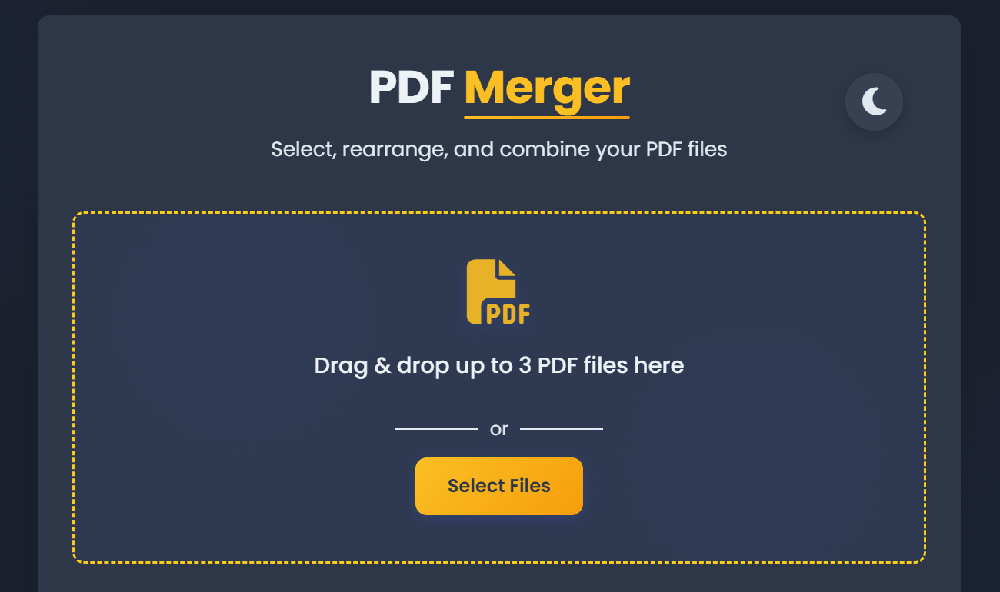

# PDF Merger



A modern web application that lets you easily combine multiple PDF files into a single document with an intuitive drag-and-drop interface.

## Features

- **Merge Multiple PDFs**: Combine up to 3 PDF files into a single document
- **Drag & Drop Interface**: Easy file selection with intuitive drag-and-drop functionality
- **File Reordering**: Arrange your PDFs in any order with simple up/down controls
- **Client-Side Processing**: All PDF processing happens in your browser - files never leave your computer for maximum privacy
- **Responsive Design**: Works seamlessly across desktop and mobile devices
- **Real-Time Feedback**: Informative notifications provide clear guidance and error messages

## Technologies Used

- **Frontend**: HTML5, CSS3, JavaScript (ES6+)
- **PDF Processing**: [PDF-lib.js](https://pdf-lib.js.org/) for client-side PDF manipulation
- **UI Components**: [Font Awesome](https://fontawesome.com/) for icons
- **Fonts**: Google Fonts (Poppins)

## Live Demo

Try the PDF Merger here: [Live Demo](https://webdev-haseeb.github.io/pdf-merger/)

## How It Works

1. **Select Files**: Either drag-and-drop your PDF files onto the designated area or click "Select Files" to choose them manually
2. **Arrange Order**: Use the up/down arrows to arrange the files in your preferred order
3. **Merge PDFs**: Click the "Merge PDFs" button to combine the files
4. **Download**: Once processing is complete, click "Download PDF" to save your merged document

## Technical Details

### PDF Processing Logic

The application uses PDF-lib.js to handle all PDF operations entirely in the browser:

```javascript
// Create a new PDF document
const mergedPdf = await PDFDocument.create();

// For each PDF file...
for (const file of selectedFiles) {
  // Read file as ArrayBuffer
  const fileArrayBuffer = await readFileAsArrayBuffer(file);
  
  // Load PDF document
  const pdfDoc = await PDFDocument.load(fileArrayBuffer);
  
  // Copy all pages to the merged document
  const pages = await mergedPdf.copyPages(pdfDoc, pdfDoc.getPageIndices());
  
  // Add each page to our merged PDF
  for (const page of pages) {
    mergedPdf.addPage(page);
  }
}

// Save and create download link
const mergedPdfBytes = await mergedPdf.save();
```

### Key Features

- **Client-Side Processing**: All PDF merging is done in the browser, ensuring your files never leave your device
- **File Validation**: Checks that only valid PDF files are processed
- **Error Handling**: Comprehensive error management for corrupted or password-protected PDFs
- **Custom Notifications**: User-friendly notification system with success/error states and auto-dismissal

## Browser Compatibility

- Chrome (latest)
- Firefox (latest)
- Safari (latest)
- Edge (latest)
- Opera (latest)

## Installation for Development

1. Clone the repository:
   ```
   git clone https://github.com/WebDev-Haseeb/pdf-merger.git
   ```

2. Navigate to the project directory:
   ```
   cd pdf-merger
   ```

3. Open `index.html` in your browser or set up a local server:
   ```
   # Using Python 3
   python -m http.server 8000
   
   # Using Node.js with http-server
   npx http-server
   ```

## Project Structure

```
├── index.html        # Main HTML structure
├── styles.css        # Styling and responsive design
├── script.js         # Application logic and PDF processing
└── favicon.svg       # App icon
```

## Limitations

- Currently limited to merging 3 PDF files at a time for optimal performance
- Does not support password-protected PDF files
- No page selection feature (merges all pages)

## Planned Features

- Increase the file limit beyond 3 PDFs
- Add page selection options for each PDF
- Preview functionality for PDFs before merging
- Support for password-protected PDFs
- PDF compression options
- Dark/light theme toggle

## Contributing

Contributions are welcome! Please feel free to submit a Pull Request.

1. Fork the repository
2. Create your feature branch (`git checkout -b feature/amazing-feature`)
3. Commit your changes (`git commit -m 'Add some amazing feature'`)
4. Push to the branch (`git push origin feature/amazing-feature`)
5. Open a Pull Request

## License

This project is licensed under the MIT License - see the [LICENSE](LICENSE) file for details.

## Credits

- [PDF-lib.js](https://pdf-lib.js.org/) for the PDF manipulation tools
- [Font Awesome](https://fontawesome.com/) for the icons

## Contact

M. Haseeb Amjad 

Project Link: [https://webdev-haseeb.github.io/pdf-merger/](https://webdev-haseeb.github.io/pdf-merger/)

---

Created with ❤️ by Haseeb © 2025